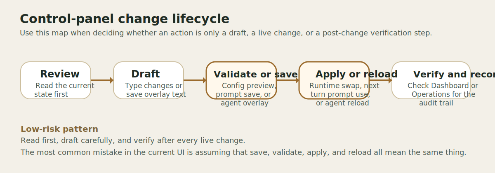

# Task Guide

## Who This Is For

Operators and admins who need step-by-step instructions for the most important control-panel workflows.

## What You Can Do Here

- Follow exact workflows for the shipped UI.
- Understand what changes immediately, what needs a reload, and what can be undone from the current interface.
- Avoid common mistakes caused by draft state, overlay behavior, or missing recovery paths.

## What To Read Next

- Use the [Access Operator Guide](access-operator-guide.md) when you need the full RBAC rollout, validation, and troubleshooting runbook.
- Use [Testing Routines](testing-routines.md) when you need a repeatable QA checklist for permissions, ingest, graphs, skills, tools, and live chat validation.
- Use the [Section Reference](section-reference.md) when you want a quick explanation of a page before following a workflow.
- Use the [Technical Reference](technical-reference.md) when you need to understand why a workflow behaves the way it does.
- Use [Troubleshooting](troubleshooting.md) if a step fails.

## Log In And Verify The System Is Healthy

**Risk: Low risk**

### Before You Begin

- Make sure the backend and the control panel are running.
- Have the admin token ready.

### Steps

1. Open the control panel URL for your environment.
2. Enter the token and click `Unlock`.
3. Stay on `Dashboard`.
4. Review `Runtime` for `status`, collection counts, agent counts, and provider/model values.
5. Review `Reload Summary` for the last known runtime outcome.

### What Changes Immediately

Only the browser session stores your token. No runtime behavior changes.

### How To Undo It

Click `Lock` or close the tab.

## Understand The Live Architecture And Routing Paths

**Risk: Low risk**

### Before You Begin

- Use this workflow when you need to explain the system to someone else or confirm how the current runtime is wired after a reload.

### Steps

1. Open `Architecture`.
2. Stay on `Map` and click `Router` to review the current routing posture.
3. Click one or more agent nodes to inspect their prompt file, overlay state, worker access, and pinned skills.
4. Open `Routing Paths` and choose a path such as `Basic response`, `Default agent`, or `Grounded lookup`.
5. Click `Trace On Map` to highlight that route back on the visual diagram.
6. Open `Live Traffic` to review recent route starts, router methods, and worker handoffs.

### What Changes Immediately

Nothing changes. The section is read-only and refreshes from live runtime state.

### How To Undo It

No undo is needed. Leave the section or lock the session when you are done.

## Validate And Apply Config Changes

**Risk: Changes live behavior**

### Before You Begin

- Know why you are changing a setting.
- Prefer configuration groups that are clearly runtime-oriented, not `Bootstrap`.
- Expect `Bootstrap` fields to be read-only in the current UI.

### Steps

1. Open `Config`.
2. Find the appropriate group such as `Providers`, `Runtime`, `Routing`, `Features`, `Sandbox`, `Observability`, or `Agent Models`.
3. Enter a draft value in the editable field.
4. Click `Validate`.
5. Review the `Preview` panel and confirm the diff and reload summary look reasonable.
6. Click `Apply` only after the preview looks correct.
7. Re-check `Dashboard` or `Operations` to confirm the reload succeeded.

### What Changes Immediately

- `Validate` does not make anything live.
- `Apply` writes the runtime environment overlay and attempts an in-process runtime swap.
- On success, future requests use the new config.
- On failure, the runtime keeps the previous overlay and the error is returned in the preview payload.

### How To Undo It

- Re-enter the known-good value and click `Apply`.
- Refresh the page to discard unsaved draft edits.
- If you need to remove a text override, clear the field and apply the empty change only if that field supports empty normalization. When in doubt, re-enter the exact target value instead of relying on empty-state behavior.

> Technical note: in the current UI, `No change` is a draft placeholder. It is not a full reset workflow for every enum or boolean field.

## Edit An Agent And Reload Agents

**Risk: Needs careful review**

### Before You Begin

- Know which agent you are editing.
- Understand the impact of changing tools, workers, skill scope, pinned skills, or limits.
- Remember that `Save Overlay` and `Reload Agents` are separate steps.

### Steps

1. Open `Agents`.
2. Select the target agent from `Available Agents`.
3. Review the current `Agent Editor` fields and the detail payload below the form.
4. Edit the fields you intend to change.
5. Click `Save Overlay`.
6. Click `Reload Agents`.
7. Re-open the agent detail or check `Operations` to confirm the reload succeeded.

### What Changes Immediately

- `Save Overlay` writes an overlay file, but the running registry does not change yet.
- `Reload Agents` validates the overlaid registry and swaps the agent registry on success.
- Failed reloads leave the last good registry in place.

### How To Undo It

- Save a corrected overlay and run `Reload Agents` again.
- In the current shipped UI, there is no visible `Reset Agent Overlay` button, so full overlay removal requires the admin API or filesystem cleanup outside the page.

## Edit Prompts And Understand Next-Turn Behavior

**Risk: Changes live behavior**

### Before You Begin

- Know which prompt file you need.
- Remember that prompt changes affect future turns, not already completed answers.

### Steps

1. Open `Prompts`.
2. Select the target prompt file from `Prompt Files`.
3. Review the prompt detail payload if you need to compare base and overlay content.
4. Edit the prompt text in `Prompt Editor`.
5. Click `Save Overlay`.
6. Run a fresh turn in the system that uses that prompt.

### What Changes Immediately

- The overlay is written right away.
- Prompt changes apply on the next turn that reads the prompt.
- No full runtime reload is required for prompt edits.

### How To Undo It

- Click `Reset Overlay` to remove the prompt overlay and return to the repo-backed base prompt.

## Create Collections, Upload Files Or Folders, And Review Collection Contents

**Risk: Changes live behavior**

### Before You Begin

- Decide whether you are reusing an existing collection or creating a new empty namespace first.
- Use host paths only for files the backend can see.
- Use browser upload for local files from your workstation or browser session.
- Use folder upload when preserving relative paths matters, especially if two files share the same basename.

### Steps

1. Open `Collections`.
2. Enter a collection ID in `Collection ID`.
3. Click `Create Collection` if you want a new persistent namespace, or choose an existing one from `Available Collections` and click `Load Workspace`.
4. Use the action tabs to choose one ingest mode at a time.
5. To ingest server-visible files, enter one or more absolute paths under `Host Paths` and click `Ingest Host Paths`.
6. To upload a few local files, click `Upload Files`.
7. To upload a whole folder and preserve relative paths, click `Upload Folder`.
8. To ingest configured KB sources, click `Sync KB`.
9. Review the action result card for ingested counts, skipped counts, missing paths, and any upload errors.
10. Review the `Documents` list.
11. Use `Search Documents` or `Source Filter` if needed.
12. Select a document to open `Document Viewer`.
13. Review the extracted content, raw source availability, logical display path, and chunk data in the detail payload.
14. Expand `Collection Inspector` when you need table names, provider, embedding model, configured dimension, actual vector dimensions, graph count, or source mix.
15. Review `Collection Health` to spot duplicate KB rows, drift, or missing files.

### What Changes Immediately

- `Sync KB` ingests configured KB sources into the selected collection.
- `Create Collection` persists an empty namespace immediately, even before any upload succeeds.
- `Ingest Host Paths` ingests host-visible files and copies them into the session workspace when possible.
- `Upload Files` stages browser-selected files in the uploads area and ingests them into the selected collection.
- `Upload Folder` preserves relative paths so repeated filenames remain distinguishable in the document list and viewer.
- `Reindex` deletes the current document record and re-ingests from the original source path if it still exists.
- `Delete` removes the document from the collection.
- `Delete Empty` removes a collection only after its documents and graph bindings are gone.

### How To Undo It

- Re-upload or re-ingest a deleted file if the source still exists.
- Use `Reindex` when the source path exists and you want a fresh ingest.
- Delete the empty collection explicitly if you created the wrong namespace.
- There is no soft-delete recovery in the current UI.

## Confirm A Collection Is Available For Graph Work

**Risk: Low risk**

### Before You Begin

- Use this workflow when you need to confirm a brand-new collection is selectable in the graph workspace before graph creation starts.

### Steps

1. Open `Collections`.
2. Create the collection if it does not exist yet.
3. Open `Graphs`.
4. Review `Graph Collection`.
5. Confirm the new collection is present in the dropdown before you save a graph draft.

### What Changes Immediately

Nothing changes if you stop after confirming the dropdown contents.

### How To Undo It

Delete the empty collection from `Collections` if you created it only for a temporary check.

## Access Control Workflows

**Risk: Changes live behavior**

Use the dedicated [Access Operator Guide](access-operator-guide.md) for the full step-by-step RBAC
runbook.

That guide covers:

- turning `AUTHZ_ENABLED` on safely
- creating principals, roles, bindings, memberships, and permissions
- previewing effective access before asking a real user to test
- recommended starter role patterns such as KB readers and graph analysts
- API backup flows for cases the shipped UI does not expose directly
- troubleshooting denied KB, graph, tool, and skill access

## Activate Or Deactivate Skills And Review Preview Results

**Risk: Changes live behavior**

### Before You Begin

- The current `Skills` page is best for editing and toggling existing skills.
- The shipped UI does not expose version rollback, even though the backend skill system supports richer lifecycle behavior.

### Steps

1. Open `Skills`.
2. Select a skill from the list.
3. Enter a query in `Preview Query`.
4. Click `Preview Match` to see whether the skill is likely to match that request.
5. Review or edit the skill body in `Skill Editor`.
6. Click `Update Skill` to save the edited body.
7. Use `Activate` or `Deactivate` to control availability.

### What Changes Immediately

- `Preview Match` is read-only.
- `Update Skill` changes the stored skill content.
- `Activate` and `Deactivate` change skill availability for future retrieval.

### How To Undo It

- Toggle status back with `Activate` or `Deactivate`.
- For content changes, restore the previous skill body through your normal version-control or skill-management process. The current UI does not expose rollback directly.

> Technical note: the current preview request uses the `general` scope in the shipped UI.

## Check Operations, Audit Events, And Reload History

**Risk: Low risk**

### Before You Begin

- Use this workflow after any live change so you can verify its result.

### Steps

1. Open `Operations`.
2. Review `last_reload` for `status`, `reason`, `actor`, and `error`.
3. Review `jobs` for active or recent background work.
4. Review `audit_events` for the most recent control-panel actions.

### What Changes Immediately

Nothing changes. This page is read-only.

### How To Undo It

No undo is needed. Leave the page or lock the session when you are done.
