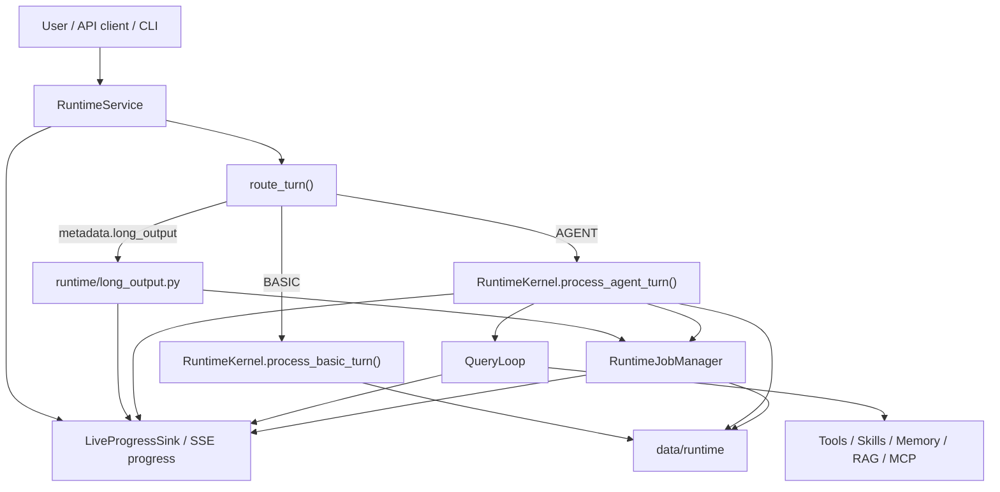

# Architecture

This repository now runs through `src/agentic_chatbot_next/`.

## Live runtime stance

The live system is a session-oriented runtime with two top-level routes:

- `BASIC`: direct chat with no tools
- `AGENT`: late-bound agent execution with tools, worker jobs, notifications, and persistence

It is not a monolithic graph runtime. LangGraph is used tactically inside the `react`
executor, while the top-level orchestration is plain Python code in the next runtime.

## Main components

### Entrypoints

- CLI: `src/agentic_chatbot_next/cli.py`
- FastAPI gateway: `src/agentic_chatbot_next/api/main.py`

Both entrypoints build `RuntimeService` from `src/agentic_chatbot_next/app/service.py`.

The FastAPI gateway also exposes returned workspace files through top-level chat
`artifacts`, SSE `artifacts` events, and `GET /v1/files/{download_id}`.

For long-form writing requests, the gateway also exposes:

- top-level chat `metadata.job_id`
- top-level chat `metadata.long_output`
- SSE `event: metadata`
- `GET /v1/jobs/{job_id}` for durable background-job inspection

For streaming chat, the gateway now also exposes a unified `progress` SSE stream backed by
router events, runtime events, tool callbacks, and RAG-controller phase updates.

The gateway also now exposes runtime skill-pack management under `/v1/skills`. Those
endpoints are scoped by `X-Tenant-ID` and `X-User-ID` when present and let operators or
clients create, update, activate, deactivate, preview, inspect, list, and roll back
runtime-authored skill packs without restarting the service.

The current gateway surface also includes runtime-managed agent inventory, capability
profiles, MCP connection/tool catalogs, task/job inspection, worker and team mailbox
continuation, document source downloads, graph catalog/query APIs, and control-panel admin
diagnostics. These endpoints all share the same request-scope headers and runtime stores as
chat turns rather than forming a separate sidecar service.

### Runtime service

`RuntimeService` owns:

- eager session-workspace open when `WORKSPACE_DIR` is configured
- upload ingest and upload-summary kickoff
- route selection
- validation and normalization of optional `metadata.requested_agent` overrides from API/demo
  callers
- detection of optional `metadata.long_output`
- choosing the initial agent
- honoring explicit manual overrides such as non-routable `rag_researcher`
- choosing synchronous composition versus background job execution for long-form writing
- per-session live-progress sink registration for streaming API turns
- handoff into the session kernel

Long-form writing is a service/runtime orchestration feature, not a new registry agent mode.
The selected route/agent still contributes prompt/style, but the service may replace the usual
single-pass agent execution with sectioned document composition.

### Router

`src/agentic_chatbot_next/router/` decides `BASIC` vs `AGENT`.

- config-backed deterministic patterns live in `router.py`, `patterns.py`, and
  `data/router/intent_patterns.json`
- the hybrid judge-model path lives in `llm_router.py`
- `policy.py` turns `suggested_agent` hints into the initial live agent selection

The deterministic router now normalizes text with casefolding, whitespace collapse, and
accent-insensitive matching before checking configured phrase and regex groups. When that
deterministic confidence is low, the runtime can escalate to the judge model. If the judge
provider circuit is open, routing degrades back to deterministic mode instead of queuing more
failing LLM calls.

The router still records the normal `BASIC` vs `AGENT` decision even when callers provide
`metadata.requested_agent`. That override is validated later by `RuntimeService` and only changes
the initial AGENT role; it does not replace router decision logging or the underlying routing
reasons.

Corpus-scale research now has a distinct routed manager: `research_coordinator`. Small grounded
lookups still prefer `rag_worker`, generic AGENT work still defaults to `general`, and broad
document discovery or deep repository research can start in `research_coordinator`.

### Session kernel

`RuntimeKernel` in `src/agentic_chatbot_next/runtime/kernel.py` owns:

- session-state hydration
- early transcript persistence
- facade-level event emission
- composite runtime event sinks for durable storage plus optional live streaming
- notification drain
- tool-context creation
- assistant-message persistence, including returned file artifact metadata
- worker jobs and mailbox continuation
- coordinator planning and worker batching
- construction of the internal `KernelRagRuntimeBridge`
- background long-form writing execution through `_run_long_output_job(...)`
- capability-profile and authorization-aware tool/context construction

`RuntimeKernel` remains the stable public entrypoint, but it is now a thinner facade over
three helper modules:

- `kernel_events.py` for transcript/live-progress emission and callback construction
- `kernel_providers.py` for provider resolution and breaker-aware wrapping
- `kernel_coordinator.py` for planner/finalizer/verifier orchestration and bounded
  revision control

### Query loop

`QueryLoop` in `src/agentic_chatbot_next/runtime/query_loop.py` is the mode dispatcher
for non-coordinator agents.

It handles:

- skill-context resolution for agents with `skill_scope`
- skill-to-hint resolution for direct RAG execution
- prompt assembly for prompt-backed modes in the order: base agent prompt,
  optional task/worker context, skill context, optional memory context
- dispatch to the react executor in `src/agentic_chatbot_next/general_agent.py`
- planner / finalizer / verifier execution
- direct RAG worker execution via `run_rag_contract(...)`
- evidence-only RAG worker execution for internal deep-search fan-out jobs
- graph-manager `react` execution for graph fast-path and delegated graph source planning
- manual/delegated `rag_researcher` execution through the same `react` path for autonomous RAG
  source selection and evidence-plan preparation
- one bounded async peer delegation from the direct `rag_worker` path when the judge model
  decides a specialist follow-up is a better next step than immediate synthesis
- direct memory-maintainer execution via heuristic extraction when `MEMORY_ENABLED=true`
- attachment of pending workspace download artifacts to the final assistant
  runtime message when tools publish files

For `react` agents, the actual tool-using turn loop is not implemented entirely inside
`QueryLoop`. `QueryLoop` prepares the run and then delegates to `general_agent.py`, which
uses LangGraph ReAct when native tool binding is available and a plan-execute fallback
otherwise.

Two live exceptions matter:

- the `rag` mode does not build or use a system prompt; it passes recent conversation
  context, uploaded doc ids, optional progress emission, optional runtime bridge support,
  and structured RAG execution hints into `run_rag_contract(...)`
- the `memory_maintainer` mode does not run a model or ReAct loop; it directly extracts
  structured key/value entries from recent messages or the delegated prompt, and the runtime
  disables that path entirely when `MEMORY_ENABLED=false`

For planned campaigns, `coordinator` still owns typed handoffs and multi-worker batching.
Peer agent messaging is now available for ad hoc same-session follow-ups through the durable
job/mailbox system, but it is intentionally bounded and secondary to coordinator orchestration.

Another important exception sits above `QueryLoop`: long-form writing does not register a new
mode in the agent registry or query loop. Instead, `RuntimeService` invokes
`src/agentic_chatbot_next/runtime/long_output.py` directly when `metadata.long_output` is
enabled.

That composer is responsible for:

- outline planning
- section-by-section model calls
- workspace draft persistence
- manifest updates for resume/debugging
- final artifact registration

### Agent registry

`AgentRegistry` loads agent definitions from `data/agents/*.md`.

Markdown frontmatter is now the live source of truth for:

- agent mode
- prompt file
- allowed tools
- allowed worker agents
- memory scopes
- max steps and tool-call limits
- role metadata

Frontmatter is validated at load time through a Pydantic schema before it becomes an
`AgentDefinition`. Loader failures are path-qualified and fail startup early. Registry-level
validation remains a separate pass for unknown tools, unknown workers, invalid memory scopes,
and missing prompt files.

Current role inventory includes both `research_coordinator` and `rag_researcher`.
`research_coordinator` is routable and marked as the research campaign manager.
`rag_researcher` is intentionally non-routable but allowed as a manual requested-agent override
and as a delegated worker.

### Provider resilience

Provider bundles are resolved once per agent role, then chat and judge models are wrapped with
provider-level circuit breakers inside `kernel_providers.py`.

Current breaker behavior:

- scoped per provider role and resolved model identity
- wraps chat and judge only, not embeddings
- opens on sustained availability failures such as timeouts, transport errors, 429s, or 5xxs
- emits breaker lifecycle events into the runtime event stream
- allows graceful degradation:
  - judge breaker open -> deterministic routing fallback
  - requested agent breaker open -> one downgrade attempt to `basic`
  - if `basic` is also unavailable -> persisted degraded-service assistant response

### Feature-gated memory and sandbox execution

Two cross-cutting runtime features are now explicitly operator-controlled:

- `MEMORY_ENABLED=false` disables managed memory-store initialization, memory tool exposure,
  post-turn memory management, file projections, and `memory_maintainer` worker availability
- `SANDBOX_DOCKER_IMAGE` defaults to the prebuilt offline analyst image
  `agentic-chatbot-sandbox:py312`

The analyst sandbox no longer installs packages at execution time. The image itself is the
package contract. The supported local repair/build path is:

```bash
python run.py build-sandbox-image
```

Both `python run.py doctor --strict` and the demo notebook preflight verify that the configured
analyst image is present locally and can import the analyst stack with `--network none`.

### Tools and skills

- tools live under `src/agentic_chatbot_next/tools/`
- skill loading and indexing live under `src/agentic_chatbot_next/skills/`

The current split is:

- tools change or inspect the outside world
- skills inject bounded operating guidance into prompts or, for direct modes like RAG,
  structured execution hints

Memory tools are part of this tool plane only when `MEMORY_ENABLED=true`.

Bound runtime tool groups today are:

- `utility`
- `discovery`
- `skills`
- `memory`
- `rag_gateway`
- `rag_workbench`
- `graph_gateway`
- `analyst`
- `orchestration`
- dynamic `mcp` tools when `MCP_TOOL_PLANE_ENABLED=true`

The live extension surface now combines repository-owned definitions with guarded runtime
extension points:

- Python-defined tool registries
- markdown-defined agents
- retrieved skill-pack context
- DB-backed runtime-authored skill packs
- DB-cached Streamable HTTP MCP tool catalogs exposed as `mcp__...` tool definitions
- per-user capability profiles and RBAC grants that clip visible tools, agents, skills,
  collections, and MCP tools

Skill packs now exist in two operational forms:

- repo-authored markdown files under `data/skill_packs/**` synced into PostgreSQL
- runtime-authored skill versions stored directly in PostgreSQL and managed through
  `/v1/skills`

Persisted runtime skill metadata now includes:

- `owner_user_id`
- `visibility`
- `status`
- `version_parent`
- `body_markdown`

Runtime resolution precedence is now:

- user-private override
- tenant-shared
- global default

The `graph_manager` role sits on top of the `graph_gateway` tool group plus bounded peer
follow-up through `invoke_agent` and `rag_agent_tool`. Its metadata marks it as
`top_level_or_worker`: the router and requested-agent override surface may start it for
graph-backed evidence, graph-inventory, or source-planning turns, and other agents may still
delegate to it as a worker.

The repo also contains helper tool factories under `src/agentic_chatbot_next/rag/`. A narrow
subset is now first-class in the registry (`resolve_indexed_docs`, `search_indexed_docs`,
`read_indexed_doc`, `compare_indexed_docs`, document extract/compare/consolidation,
template/evidence, and requirements extraction/export), while the live `rag_worker` and
`rag_agent_tool` paths still use the direct Python retrieval controller for adaptive
retrieval and synthesis.

RAG-oriented skill packs are now partly machine-readable. In addition to prompt prose,
indexed skill metadata can drive:

- `retrieval_profile`
- `controller_hints`
- `coverage_goal`
- `result_mode`

The `rag_workbench` group is the exploratory surface used by `rag_researcher`. Its tools plan
query facets, search chunks and document sections, inspect document structure, filter indexed
documents, grade/prune evidence candidates, validate the evidence plan, and build
`controller_hints_json` for final `rag_agent_tool` synthesis. Those tools are deferred for
general agents and eager only for `rag_researcher`.

### RAG

The live RAG flow lives under `src/agentic_chatbot_next/rag/`.

The stable contract is unchanged:

- `answer`
- `citations`
- `used_citation_ids`
- `confidence`
- `retrieval_summary`
- `followups`
- `warnings`

Grounded document work now has two live execution shapes:

- direct specialist routing, where grounded prompts start in `rag_worker`
- delegated tool-path execution, where `general` or `verifier` calls `rag_agent_tool`

The demo notebook and API tests may pin the delegated shape with `metadata.requested_agent=general`,
but the normal runtime still prefers direct `rag_worker` starts for bounded grounded lookups.

Internally, the live controller is now adaptive:

- `fast` mode does one bounded hybrid retrieval and grading pass
- `auto` mode escalates from fast to deep when the question is complex or evidence is weak
- `deep` mode can perform multi-round retrieval, chunk-window expansion, document-focused
  rereads, pruning, and bounded internal evidence-worker fan-out

Candidate ordering now also includes the optional Ollama reranker layer when `RERANK_ENABLED=true`.
The default local reranker is `rjmalagon/mxbai-rerank-large-v2:1.5b-fp16`; if it is unavailable,
the runtime can fall back to deterministic heuristics.

The retrieval stack is also graph-augmented when graph features are enabled. PostgreSQL
full-text and pgvector remain the default lexical and semantic base. Managed graph catalogs,
GraphRAG project artifacts, graph query cache rows, and graph source records live in
PostgreSQL-backed stores; `GRAPH_BACKEND=microsoft_graphrag` is the default, with Neo4j kept
as an optional compatibility backend.

The deep path uses:

- `CorpusRetrievalAdapter` for backend-agnostic retrieval operations
- an internal evidence ledger for round summaries and evidence state
- `KernelRagRuntimeBridge` to reuse durable worker jobs for evidence-only `rag_worker`
  subtasks
- one final synthesis step after evidence merge

When graph search is enabled, graph traversal yields candidate documents, clauses, or chunk
ids, but grounded text chunks remain the citation source of truth. GraphRAG augments the
current retrieval path; it does not replace the existing vector and keyword path.

The direct `rag_worker` path is now also shaped by structured hints resolved from skill
packs and planner/coordinator payloads.

For spreadsheet evidence, adaptive RAG can ask the runtime bridge to run bounded
`data_analyst` tabular-evidence jobs. The analyst uses `profile_dataset` first, then returns
structured findings and source refs that the RAG layer converts into citation-eligible tabular
evidence before synthesis.

Large corpus-mining requests are intentionally split above the direct RAG layer:

- small grounded lookups stay on direct `rag_worker`
- broad corpus discovery, inventories, and exhaustive comparisons route to
  `research_coordinator` / coordinator-owned research campaigns

That keeps `rag_worker` specialized for retrieval while `coordinator` remains the owner of
durable sub-agent orchestration.

When the task needs a source-selection-heavy exploratory loop rather than a broad campaign,
callers or coordinators can use `rag_researcher`. It is a prompt-backed ReAct specialist that
uses `rag_workbench` and graph source-planning tools before calling `rag_agent_tool`.

Coordinator-owned typed handoffs are now the supported worker-to-worker pattern. The runtime
passes validated artifacts such as:

- `analysis_summary`
- `entity_candidates`
- `keyword_windows`
- `doc_focus`
- `evidence_request`
- `evidence_response`

Those artifacts are persisted in session metadata, validated before use, and only exposed to
workers that are allowed to consume them. Free-form peer worker messaging is still not the
supported design.

The public `RagContract` is preserved even as these internals become more agentic.

### Memory

When `MEMORY_ENABLED=true`, the live runtime initializes a managed PostgreSQL memory store
(`memory_records`, `memory_observations`, and `memory_episodes`) plus the legacy key/value
`memory` table used during import and compatibility flows.

`data/memory/...` is now a projection and fallback layer rather than the normal source of
truth. `memory_save`, `memory_load`, and `memory_list` prefer the managed store when it is
available and project session views back to `index.json`, `MEMORY.md`, `topics/*.md`, and
`groups/*.md` for human inspection. If the managed store is unavailable, the file store can
still serve as a local fallback.

Post-turn memory maintenance first uses the managed memory manager when configured through
`MEMORY_MANAGER_MODE` (`shadow`, `selector`, or `live`). The older heuristic extractor remains
as a fallback/compatibility path for explicit structured memory intent. The delegated
`memory_maintainer` role still exists for explicit worker use, but the normal post-turn memory
path is kernel-owned rather than an automatic delegated agent run. When `MEMORY_ENABLED=false`,
neither path runs and the memory tool surface disappears.

### Context Budgeting

When `CONTEXT_BUDGET_ENABLED=true`, `ContextBudgetManager` estimates prompt, history, and tool
result size before model calls. It can compact older history into a persisted boundary, restore
recent file/skill handles, and microcompact large current-turn tool results into sidecar
references. These controls are runtime context management, not user-visible summarization.

### Persistence

The next runtime persists file-backed runtime artifacts such as:

- session state
- transcripts
- events
- notifications
- jobs
- mailbox messages
- context compaction boundaries and large tool-result sidecars
- worker artifacts
- long-form job state and metadata

under `data/runtime/...`, keyed through `filesystem_key(...)`.

Long-form document drafts themselves are workspace artifacts rather than runtime job artifacts.
The usual split is:

- `data/workspaces/...`: generated Markdown or text drafts, manifests, optional per-section files
- `data/runtime/jobs/...`: job state, transcripts, events, and worker-owned job artifacts
- PostgreSQL: documents, chunks, skills, memory, access/capability/MCP data, requirements, and
  graph metadata
- object storage when configured: uploaded/source-file bytes and larger persisted artifacts

## User-facing progress timeline

The live `progress` SSE stream is intentionally a summarized task timeline rather than raw
chain-of-thought.

Current milestone and status families include:

- `route_decision`
- `agent_selected`
- `decision_point`
- `phase_start`, `phase_update`, `phase_end`
- `task_plan`
- `worker_start`, `worker_end`
- `doc_focus`
- `tool_intent`
- `evidence_status`
- `handoff_prepared`, `handoff_consumed`
- `summary`

Common payload fields now include `label`, `detail`, `agent`, `job_id`, `task_id`, `docs`,
`counts`, `why`, and `waiting_on`.

Frontend transparency is filtered by `FRONTEND_EVENTS_*` settings. The live stream can include
safe `agent_context_loaded` audit items describing prompt docs, resolved skills, context
sections, and redacted memory/context previews without exposing raw chain-of-thought.

## High-level flow


