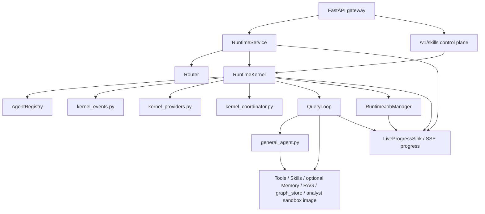

# C4 Architecture

## System context

```mermaid
flowchart TD
    user["User"]
    cli["CLI"]
    api["FastAPI gateway"]
    runtime["agentic_chatbot_next"]
    pg["PostgreSQL + pgvector"]
    graph["Optional Neo4j graph_store"]
    disk["data/runtime + data/workspaces + data/memory"]

    user --> cli --> runtime
    user --> api --> runtime
    runtime --> pg
    runtime --> graph
    runtime --> disk
```

## Container view



## Component notes

- `RuntimeService` is the live service boundary
- `RuntimeService` also validates optional `metadata.requested_agent` overrides. The router still
  records its normal decision; the override only changes the initial AGENT role when valid.
- the FastAPI gateway now has three public surfaces:
  - OpenAI-compatible chat, file, job, upload, and connector endpoints
  - a graph catalog/query surface under `/v1/graphs`
  - a runtime skill control plane under `/v1/skills` for DB-backed skill CRUD,
    activation, preview, and rollback
- `RuntimeKernel` is the stable persisted-session facade; `kernel_events.py`,
  `kernel_providers.py`, and `kernel_coordinator.py` now hold its extracted event,
  provider/breaker, and coordinator orchestration concerns
- `QueryLoop` dispatches by agent mode; prompt-backed modes get prompt, memory, and skill
  context, while `rag` converts retrieved skills into structured execution hints and
  `memory_maintainer` uses a direct execution path only when `MEMORY_ENABLED=true`
- `LiveProgressSink` is the streaming-only progress spine used by the chat UI timeline
- that timeline is intentionally summarized: it exposes routing, phase, handoff, tool, and
  evidence milestones such as `decision_point`, `tool_intent`, `evidence_status`,
  `handoff_prepared`, and `handoff_consumed` instead of raw chain-of-thought
- `RuntimeJobManager` now supports coordinator-owned typed handoffs in addition to durable
  workers and mailboxes
- `general_agent.py` is the live react executor for tool-using `react` agents
- `AgentRegistry` loads markdown-defined roles from `data/agents/*.md`, including
  delegated-only workers such as `graph_manager`
- `RuntimeJobManager` owns durable workers and mailboxes for both coordinator-owned
  research campaigns and internal RAG evidence jobs
- feature-flagged team mailbox channels layer typed peer status, handoff, and question
  messages on the same job/transcript JSONL backing store
- `graph_store` is optional, feature-flagged, and augments rather than replaces PostgreSQL
  retrieval
- the analyst sandbox is an offline image contract rather than a runtime package-install path;
  the default local image is `agentic-chatbot-sandbox:py312`, built with
  `python run.py build-sandbox-image` and checked by `doctor --strict` plus notebook preflight
- coordinator-owned typed handoffs are now the supported worker-to-worker pattern:
  `analysis_summary`, `entity_candidates`, `keyword_windows`, `doc_focus`,
  `evidence_request`, and `evidence_response`
