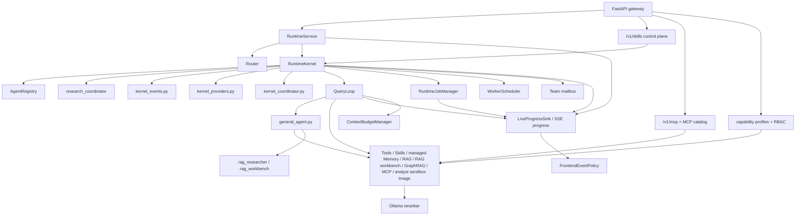

# C4 Architecture

## System context

```mermaid
flowchart TD
    user["User"]
    cli["CLI"]
    api["FastAPI gateway"]
    runtime["agentic_chatbot_next"]
    pg["PostgreSQL + pgvector"]
    mcp["Streamable HTTP MCP servers"]
    graph["Managed GraphRAG + optional Neo4j compatibility"]
    disk["data/runtime + data/workspaces + memory projections"]

    user --> cli --> runtime
    user --> api --> runtime
    runtime --> pg
    runtime --> mcp
    runtime --> graph
    runtime --> disk
```

## Container view



## Component notes

- `RuntimeService` is the live service boundary
- `RuntimeService` also validates optional `metadata.requested_agent` overrides. The router still
  records its normal decision; the override only changes the initial AGENT role when valid.
- the FastAPI gateway now has several public surfaces:
  - OpenAI-compatible chat, file, job, task, upload, and connector endpoints
  - a graph catalog/query surface under `/v1/graphs`
  - a runtime skill control plane under `/v1/skills` for DB-backed skill CRUD,
    activation, preview, and rollback
  - MCP connection/tool management under `/v1/mcp`
  - capability profile catalog/read/update endpoints under `/v1/capabilities` and
    `/v1/users/me/capabilities`
  - worker and team mailbox continuation endpoints under `/v1/jobs/.../mailbox` and
    `/v1/sessions/.../team-mailbox`
- `RuntimeKernel` is the stable persisted-session facade; `kernel_events.py`,
  `kernel_providers.py`, and `kernel_coordinator.py` now hold its extracted event,
  provider/breaker, and coordinator orchestration concerns
- `QueryLoop` dispatches by agent mode; prompt-backed modes get prompt, memory, and skill
  context, while `rag` converts retrieved skills into structured execution hints and
  `memory_maintainer` uses a direct execution path only when `MEMORY_ENABLED=true`
- `LiveProgressSink` is the streaming-only progress spine used by the chat UI timeline
- that timeline is intentionally summarized: it exposes routing, phase, handoff, tool, and
  evidence milestones such as `decision_point`, `tool_intent`, `evidence_status`,
  `handoff_prepared`, and `handoff_consumed` instead of raw chain-of-thought
- `RuntimeJobManager` now supports coordinator-owned typed handoffs in addition to durable
  workers and mailboxes
- `general_agent.py` is the live react executor for tool-using `react` agents
- `AgentRegistry` loads markdown-defined roles from `data/agents/*.md`, including
  `graph_manager` as a `top_level_or_worker` graph specialist, `research_coordinator` as the
  routed research campaign manager, and `rag_researcher` as a manual/delegated ReAct RAG
  researcher
- `rag_researcher` uses deferred `rag_workbench` tools for query planning, chunk/section
  search, evidence grading/pruning, evidence-plan validation, and final RAG controller hint
  construction
- `RuntimeJobManager` owns durable workers and mailboxes for both coordinator-owned
  research campaigns and internal RAG evidence jobs
- `ContextBudgetManager` owns optional autocompaction, current-turn tool-result
  microcompaction, and restore snapshots when `CONTEXT_BUDGET_ENABLED=true`
- `FrontendEventPolicy` filters what the streaming progress layer forwards, including safe
  context/audit events such as `agent_context_loaded`
- the optional Ollama reranker is part of retrieval candidate ordering for graph and RAG
  evidence when `RERANK_ENABLED=true`
- feature-flagged team mailbox channels layer typed peer status, handoff, and question
  messages on the same job/transcript JSONL backing store
- managed GraphRAG is the default graph backend, with Neo4j compatibility available as an
  optional backend; graph retrieval augments rather than replaces PostgreSQL text evidence
- managed memory is PostgreSQL-backed; `data/memory` contains projections/fallback files for
  inspection rather than the normal authoritative store
- the analyst sandbox is an offline image contract rather than a runtime package-install path;
  the default local image is `agentic-chatbot-sandbox:py312`, built with
  `python run.py build-sandbox-image` and checked by `doctor --strict` plus notebook preflight
- coordinator-owned typed handoffs are now the supported worker-to-worker pattern:
  `analysis_summary`, `entity_candidates`, `keyword_windows`, `doc_focus`,
  `evidence_request`, and `evidence_response`
