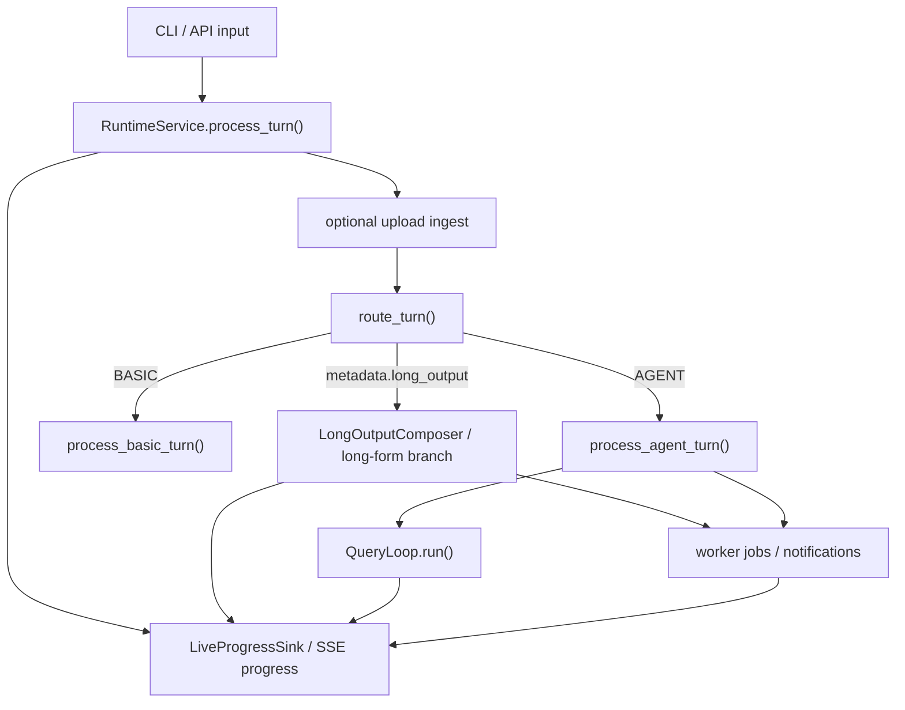

# Control Flow

This document describes the current live turn flow through `agentic_chatbot_next`.

## End-to-end path

## 1. Transport layer

The FastAPI gateway and CLI normalize user input, conversation scope, and uploads, then call
`RuntimeService`.

For API callers, the gateway can also translate returned workspace files into
OpenAI-compatible chat `artifacts` metadata and `/v1/files/{download_id}`
download links.

The gateway also now exposes runtime skill CRUD and preview endpoints under `/v1/skills`,
scoped by `X-Tenant-ID` and `X-User-ID` when supplied.

`POST /v1/chat/completions` also accepts `metadata.requested_agent` for explicit demo/operator
control of the initial AGENT role. Invalid override values fail fast with `400` before the
runtime starts the turn.

The same endpoint now also accepts `metadata.long_output` for opt-in long-form writing. That
path still uses the normal route decision first, then applies long-form orchestration on top of
the selected route/agent.

For streaming API callers, `_stream_with_progress(...)` also creates a `LiveProgressSink`,
attaches a `ProgressCallback`, and forwards named SSE `progress` events while the turn is
executing.

## 2. Service layer

`RuntimeService.process_turn(...)`:

1. eagerly opens the canonical session workspace when `WORKSPACE_DIR` is configured
2. ensures the KB is indexed for the tenant
3. when uploads are present, ingests them and appends a RAG-generated upload summary into
   session history
4. when a live progress sink is present, registers it for the active session
5. calls the router
6. emits a router-decision event
7. validates any requested-agent override against the current routable registry surface
8. if the judge router path is degraded, falls back to deterministic routing and emits a
   router-degradation event
9. when `metadata.long_output.enabled=true`, selects a long-form branch after routing and
   agent selection
10. otherwise hands off to `RuntimeKernel.process_basic_turn(...)` or
    `RuntimeKernel.process_agent_turn(...)`
11. if an agent chat provider is unavailable, attempts one downgrade to `basic`
12. if `basic` is also unavailable, persists a degraded-service assistant response
13. unregisters the live progress sink after the turn completes

The router decision is still recorded even when a requested-agent override is applied. The
override only changes the initial AGENT role after routing has already decided the turn belongs
on the AGENT path.

Long-form writing is not a new top-level route. It is a service-layer orchestration feature that
reuses the selected route/agent:

- for moderate requests, the active turn runs a synchronous `LongOutputComposer`
- for larger requests, the service queues a durable background job when thresholds and agent
  background capability allow it

The current default background thresholds are:

- above roughly `3000` target words
- more than `5` target sections
- or `async_requested=true`

In both cases, the runtime only appends a short assistant summary to session history. The full
draft is written into the session workspace and exposed back through the normal artifact flow.

## 3. BASIC route

`RuntimeKernel.process_basic_turn(...)`:

1. hydrates or creates `SessionState`
2. drains pending notifications
3. appends the user turn
4. persists state and transcript before model execution
5. emits `basic_turn_started`
6. runs the basic chat executor
7. appends the assistant turn
8. persists state and transcript again
9. emits `basic_turn_completed`

If the selected `basic` chat provider breaker is already open, `RuntimeService` now skips the
model call and persists a degraded-service assistant response instead of raising back to the
caller.

## 4. AGENT route

`RuntimeKernel.process_agent_turn(...)`:

1. hydrates or creates `SessionState`
2. drains pending notifications
3. appends the user turn
4. persists state and transcript before execution
5. resolves the initial agent from `data/agents/*.md`, using a validated requested-agent
   override when present
6. builds callbacks and emits `turn_accepted`, `agent_run_started`, and `agent_turn_started`
7. delegates to `run_agent(...)`

The emitted route metadata now includes `requested_agent_override` and
`requested_agent_override_applied` so trace readers can distinguish normal router-selected starts
from explicit demo/operator control.

If `run_agent(...)` fails because the requested chat provider breaker is open, the service layer
may downgrade the turn to `basic` once. That downgrade does not reroute through planner or
worker orchestration; it is a top-level resilience path.

## 5. Non-coordinator agent execution

`RuntimeKernel.run_agent(...)`:

1. builds `ToolContext`
2. resolves the allowed tool set for the selected agent
3. calls `QueryLoop.run(...)`
4. writes the returned messages back into session state, including assistant
   artifact metadata when tools published files
5. emits completion/failure events

`ToolContext` now also carries:

- `progress_emitter` for live progress emission
- `rag_runtime_bridge` for internal deep-search worker fan-out when the active mode is `rag`

Long-form writing bypasses this normal single-pass `run_agent(...)` path. Instead, the service
layer constructs a `LongOutputComposer`, which:

- plans an outline
- writes one section per model call
- stores a workspace-backed draft and manifest
- returns a short user-facing summary plus artifact metadata

## 6. Coordinator execution

For `coordinator`, the kernel runs:

1. planner
2. worker batching
3. finalizer
4. verifier
5. bounded finalizer/verifier revision rounds if verification requests changes

Workers run as durable jobs with mailbox continuation and notification reinjection.

For broad document-research asks, this path is now also the owner of long-running research
campaigns. `planner` can emit multiple `rag_worker` tasks with:

- focused `doc_scope`
- `skill_queries`
- `research_profile`
- `coverage_goal`
- `result_mode`
  - `controller_hints`

Coordinator-owned typed handoffs can now also connect workers. Tasks may declare produced and
consumed artifacts such as `analysis_summary`, `entity_candidates`, `keyword_windows`,
`doc_focus`, `evidence_request`, and `evidence_response`. The coordinator validates those
artifacts, persists them into session metadata, emits handoff progress events, and injects the
approved subset into downstream worker requests.

Revision rounds are now capped by `MAX_REVISION_ROUNDS` / `settings.max_revision_rounds`
(default `4`). The cap applies to finalizer/verifier rounds only; planner and worker batches are
not rerun inside revision loops.

## 7. Query loop execution modes

`QueryLoop.run(...)` resolves skill context for agents that declare `skill_scope`, then
dispatches by mode:

- `react`, `planner`, `finalizer`, and `verifier` build prompts from base prompt,
  optional task/worker context, skill context, and bounded file-memory context
- `rag` resolves skill-driven execution hints, then calls `run_rag_contract(...)`
  directly with recent conversation context, uploaded doc ids, optional runtime-bridge
  support, and optional live-progress emission
- `memory_maintainer` skips prompt/model execution and runs direct heuristic extraction when
  `MEMORY_ENABLED=true`

For `rag`, the direct contract path may now also consume coordinator handoff artifacts to seed
document focus, entity candidates, keyword windows, and evidence requests before retrieval
starts.

For delegated deep-search evidence jobs, `QueryLoop._run_rag(...)` can also switch into an
evidence-only mode. In that path it runs retrieval only, returns structured evidence
metadata, and disables nested internal fan-out.

There are now two distinct fan-out layers for document work:

- coordinator-owned campaign workers for user-visible multi-task research
- runtime-owned internal evidence workers for bounded deep-retrieval assistance inside a
  single RAG run

`rag_worker` participates in both, but it does not become a durable sub-agent manager.

The class still contains a `basic` handler for parity, but the normal BASIC service path
goes straight through `RuntimeKernel.process_basic_turn(...)` rather than through
`QueryLoop.run(...)`.

For `react` agents, `QueryLoop` then delegates to
`src/agentic_chatbot_next/general_agent.py`.

That executor:

- uses LangGraph `create_react_agent(...)` when the model supports tool binding
- falls back to a plan-execute loop when tool binding is unavailable or forced
- keeps `data_analyst` on the guided `plan_execute` path when the agent metadata requests it
- owns recovery from native tool-loop failure, missing final answers, and truncated outputs

## 8. Persistence timing

The live runtime persists accepted user turns before execution begins.

That means resume/debugging artifacts survive:

- model failures
- tool failures
- worker failures
- partially completed long-form sections and manifests

## 9. Observability

Local runtime events are the source of truth.

For streaming UI turns, the runtime also derives an ephemeral live progress stream from:

- router events
- kernel runtime events
- LangChain tool callbacks
- adaptive RAG controller phase updates

Current event families include:

- router decisions
- turn acceptance / completion / failure
- basic-turn lifecycle
- agent-run lifecycle
- agent-turn lifecycle
- model lifecycle
- tool lifecycle
- coordinator planning/batch/finalizer/verifier events
- coordinator revision-limit events
- worker-job lifecycle, mailbox, and notification append events
- notification append events
- memory extraction events
- provider breaker lifecycle and degraded-service events
- coordinator handoff lifecycle

When `MEMORY_ENABLED=false`, the runtime does not emit the memory-extraction family because the
post-turn heuristic maintenance path and `memory_maintainer` worker path are both disabled.

The streaming `progress` event layer now surfaces summarized milestones such as:

- `route_decision`
- `agent_selected`
- `decision_point`
- `phase_start`, `phase_update`, `phase_end`
- `task_plan`
- `worker_start`, `worker_end`
- `doc_focus`
- `tool_intent`
- `evidence_status`
- `handoff_prepared`, `handoff_consumed`
- `summary`
- plus tool callback events like `tool_call`, `tool_result`, and `tool_error`

For long-form writing, the main progress milestones are:

- `phase_start` for outline or draft startup
- `phase_update` while each section is generated
- `phase_end` when the final artifact or background job acknowledgement is ready

Progress payloads may also now include `why` and `waiting_on` to support inline client
task summary without exposing raw chain-of-thought.

Router-derived payloads may also include `requested_agent_override` and
`requested_agent_override_applied`.

The post-turn memory path is heuristic today, not a dedicated maintenance-agent loop. It writes
conversation memory from structured entries in the latest user turn and only writes user memory
when the turn contains explicit memory intent.

Worker failures currently surface as `job_failed`; there is no separate
`worker_agent_failed` runtime event in the live implementation.
