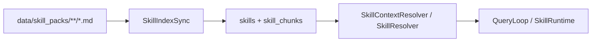

# Skills Playbook

The runtime uses two complementary skill layers.

## 1. Base role prompts

Base prompts live in `data/skills/*.md`.

Examples:

- `general_agent.md`
- `rag_agent.md`
- `utility_agent.md`
- `data_analyst_agent.md`
- `planner_agent.md`
- `finalizer_agent.md`
- `supervisor_agent.md` for the live `coordinator`

These files define stable role behavior and should stay compact.

## 2. Runtime skill packs

Runtime skill packs live in `data/skill_packs/**/*.md` when repo-authored and in
PostgreSQL when runtime-authored through `/v1/skills`.

They are:

- file-authored
- version-controlled
- synced into PostgreSQL
- retrieved dynamically through `SkillContextResolver`

The live runtime now also supports runtime-authored skill packs stored directly in
PostgreSQL and managed through the FastAPI `/v1/skills` surface.

That means there are now two operational sources for skill packs:

- repo-authored markdown skill packs synced into the DB
- runtime-authored DB skill versions created, updated, previewed, activated, deactivated,
  or rolled back without restart

Skill packs can be `retrievable`, `executable`, or `hybrid`.

- `retrievable` packs contribute guidance through automatic context resolution and
  `search_skills`
- `executable` packs are discoverable but run only through the explicit `execute_skill`
  tool
- `hybrid` packs do both

## Skill-pack metadata

Supported metadata includes:

- `skill_id`
- `kind`: `retrievable`, `executable`, or `hybrid`
- `agent_scope`
- `tool_tags`
- `task_tags`
- `version`
- `enabled`
- `description`
- `retrieval_profile`
- `controller_hints`
- `coverage_goal`
- `result_mode`
- `execution_config`

Runtime-authored skill records also persist scope and version fields such as:

- `owner_user_id`
- `visibility`
- `status`
- `version_parent`
- `body_markdown`

Executable skill frontmatter also supports these aliases:

- `allowed-tools` or `allowed_tools`
- `context`: `inline` or `fork`
- `agent`: worker agent for `context: fork`, defaulting to `utility`
- `model`: `inherit` or an explicit configured chat model override
- `effort`: `low`, `medium`, `high`, or `xhigh`
- `input_schema`
- `max_steps`
- `max_tool_calls`

Example:

```markdown
---
name: Contract Review
kind: executable
agent_scope: general
version: 1
enabled: true
description: Run the standard contract review checklist.
allowed-tools: search_skills, read_indexed_doc
context: fork
agent: utility
model: inherit
effort: medium
max_steps: 6
max_tool_calls: 8
---
# Contract Review

Review {{input}} using {{ARGUMENTS_JSON}}.
```

## Indexing flow



Runtime-authored skill CRUD bypasses the file-sync step and writes directly into the same
DB-backed resolution layer used by the runtime.

Capability profiles and RBAC can further clip what a user can see or run. A skill pack must
match normal scope/precedence rules and also pass enabled/disabled skill-pack lists,
skill-family grants, and executable-skill feature flags before it affects a turn.

## Runtime flow in the current kernel

For a prompt-backed runtime agent that has `skill_scope` set and runs through `QueryLoop`:

1. the loop resolves bounded skill context for the current user text
2. the context is attached to `ToolContext.skill_context`
3. the base prompt is extended with a `## Skill Context` block
4. the agent runs with targeted guidance for that turn

This replaces the older framing where executor-local prompt assembly was the main way to
inject retrieved skills.

For direct RAG execution, the flow is different:

1. `QueryLoop._run_rag(...)` resolves skill matches from `skill_queries`, the active
   `skill_scope`, and the current task payload
2. prose skill content may still be attached for compatibility and debugging
3. machine-readable skill metadata is converted into structured RAG execution hints
4. `run_rag_contract(...)` consumes those hints directly

This means RAG skill packs are now operational, not just descriptive prompt text.

## Where skill retrieval is used

Current runtime roles where retrieved skill context materially affects execution:

- `general`
- `utility`
- `data_analyst`
- `planner`
- `finalizer`
- `verifier`
- `rag_worker`

The exact scope is controlled by `AgentDefinition.skill_scope`.

Additional live nuance:

- `rag_worker` now consumes skill-derived structured execution hints for the live direct
  contract path; prompt prose is secondary to those structured hints
- `memory_maintainer` also declares `skill_scope`, but its dedicated mode bypasses
  prompt/model execution and does not consume the resolved skill block; the role is unavailable
  entirely when `MEMORY_ENABLED=false`
- the normal BASIC route goes straight through `RuntimeKernel.process_basic_turn(...)`, so
  the `basic` registry role is not the main automatic skill-injection path

`coordinator` is the main exception in the live runtime. It has role metadata in the
registry, but its `coordinator` mode is orchestrated directly by the kernel rather than by
the normal `QueryLoop` skill-context path.

In practice, `planner` and `coordinator` now pre-assign likely RAG skill packs to workers
through `skill_queries` plus structured RAG hint fields. That keeps `rag_worker`
specialized while still allowing prompt-backed workers to call `search_skills` when they
need an explicit lookup.

## Runtime skill control plane

The live gateway now exposes DB-backed skill management under `/v1/skills`.

High-level operations:

- list
- inspect
- create
- update
- activate
- deactivate
- rollback
- preview
- preview execution

Those operations are scoped through `X-Tenant-ID` and `X-User-ID`.

Executable-skill creation and execution are gated by `EXECUTABLE_SKILLS_ENABLED=true`.
When disabled, executable records can remain inert and `execute_skill` is not bound into
agent tool surfaces.

## Scope and precedence

When more than one matching skill exists, the current precedence is:

1. user-private override
2. tenant-shared
3. global default

Guardrails:

- user-authored skills default to private drafts until explicitly activated
- runtime CRUD changes become effective on the next retrieval/search
- core agent role prompts remain file-authored and are not part of the runtime CRUD surface
- executable skills never elevate tools; the skill allow-list is intersected with both
  the caller and, for forked skills, the selected worker
- capability profiles and RBAC can remove skills or MCP/tools from the effective surface even
  when the skill metadata itself is valid
- `execute_skill` is denied inside a running executable skill to prevent recursive tool
  execution
- `context: fork` runs synchronously through the existing worker/job path with an isolated
  transcript, then returns the worker result to the parent turn

## Operational RAG hint fields

RAG-specific skill packs can shape the live retrieval controller through:

- `retrieval_profile`
  Drives high-level retrieval posture such as `targeted_lookup`,
  `corpus_discovery`, `comparison_campaign`, or `process_flow_identification`.
- `controller_hints`
  Fine-grained retrieval toggles such as inventory-first output, windowed keyword
  follow-up, process-flow bias, or stronger negative-evidence reporting.
- `coverage_goal`
  Describes how exhaustive the answer must be, such as `focused_answer`,
  `corpus_wide`, or `exhaustive_inventory`.
- `result_mode`
  Tells the direct RAG path whether to synthesize a normal answer, produce a per-document
  inventory, or otherwise keep document-level structure.

These fields are internal runtime hints. They do not change the public `RagContract`.

## File sync vs runtime CRUD

The repo still supports file sync for curated/default skill packs:

```bash
python run.py index-skills
```

But file sync and runtime CRUD serve different purposes:

- file sync: curated, version-controlled defaults checked into the repo
- runtime CRUD: tenant or user customization, activation experiments, and quick iteration
  without restart

Both feed the same live DB-backed resolution layer.

## Relationship to `search_skills`

Retrieved skill context and `search_skills` are different mechanisms:

- `SkillContextResolver` is automatic, bounded, and kernel-driven
- `search_skills` is a model-invoked tool for explicit lookup during a turn

Both remain useful, but they are no longer interchangeable.

The current preferred split is:

- prompt-backed agents may use `search_skills` for just-in-time lookup
- `planner` and `coordinator` should seed `rag_worker` with `skill_queries` and structured
  hints
- `rag_worker` should not depend on free-form runtime skill search as its primary control
  mechanism

`/v1/skills/preview` sits between those layers: it lets operators inspect how a skill body
or metadata update would resolve in retrieval without having to activate it first.

`/v1/skills/{skill_id}/preview-execution` is the execution-side dry run. It renders the
prompt and normalized execution metadata without launching a worker, and requires skill
manage permission or an admin token because it exposes executable instructions.

## Current document-research packs

Key packs added for corpus-scale document research include:

- `rag/citation_hygiene`
- `rag/clause_extraction`
- `rag/collection_scoping`
- `rag/comparison_campaign`
- `rag/corpus_discovery`
- `rag/coverage_sufficiency_audit`
- `rag/cross_document_inventory`
- `rag/document_resolution`
- `rag/empty_result_recovery`
- `rag/graph_drift_followup`
- `rag/graph_freshness_and_staleness_check`
- `rag/graph_global_community_discovery`
- `rag/graph_grounding_and_resolve_back`
- `rag/graph_local_relationship_tracing`
- `rag/graph_vs_vector_source_selection`
- `rag/knowledge_base_search_guidance`
- `rag/multi_document_comparison`
- `rag/negative_evidence_reporting`
- `rag/process_flow_identification`
- `rag/retrieval_strategy`
- `rag/windowed_keyword_followup`
- `general/document_research_delegation`
- `planner/document_campaign_planning`
- `finalizer/document_campaign_synthesis`
- `verifier/corpus_coverage_and_overclaim_check`

## Commands

Index skill packs:

```bash
python run.py index-skills
```

Inspect indexed skills:

```bash
python run.py list-skills
python run.py inspect-skill <skill_id>
```
